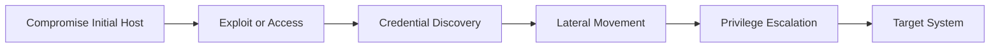
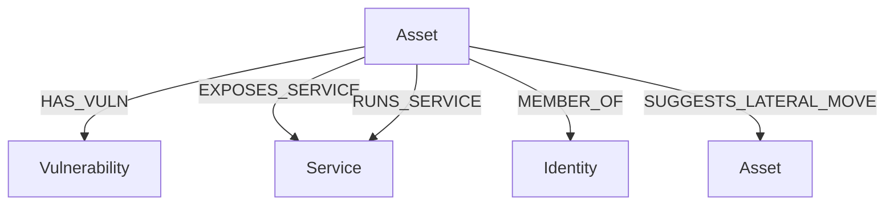
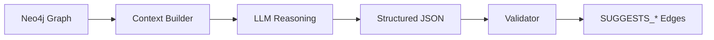
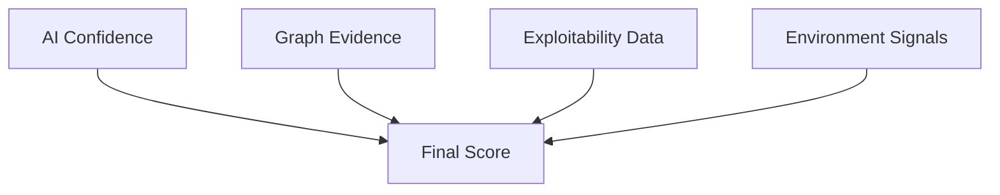
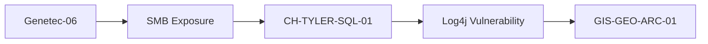

# Sariel

**Sariel is a proactive cybersecurity attack-path platform that models, predicts, and explains how adversaries move through your environment—before they do.**

---

## High-Level Architecture

```mermaid
flowchart LR
    A[Data Sources] --> B[Ingestion Layer]
    B --> C[Normalization Engine]
    C --> D[Neo4j Graph]
    D --> E[Context Builder]
    E --> F[AI Attack Mapper]
    F --> G[Validation Layer]
    G --> H[Suggested Edges]
    H --> I[Analyst Review]
    I --> J[Confirmed Attack Paths]
```

---

## Attack Path Flow

---

## Graph Model

---

## AI Mapping Pipeline

---

## Confidence Model

---

## Example Attack Path

---

## Vision

Security teams should know the attacker’s path **before the attacker takes it.**
