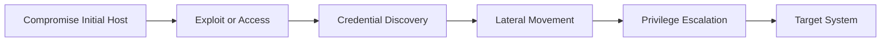
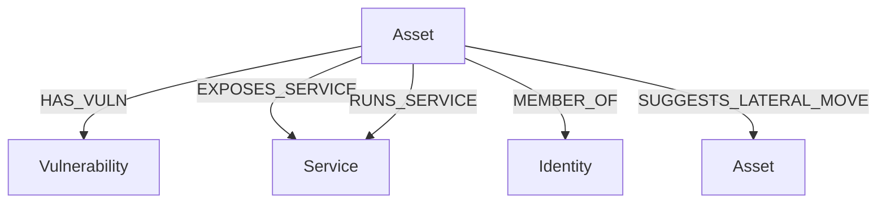
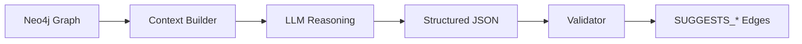
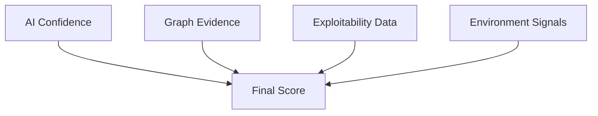
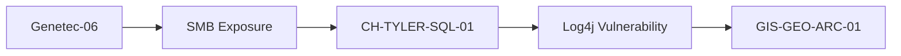

# Sariel

**Sariel is a proactive cybersecurity attack-path platform that models, predicts, and explains how adversaries move through your environment—before they do.**

Traditional security is reactive.  
Sariel is designed to answer:

> *“If an attacker compromises this system, what can they actually do next?”*

---

## Why Sariel Exists

Cybersecurity has historically followed a reactive model:

Exploit happens → Patch deployed  
New technique → New detection  
Repeat  

Sariel flips that model:

Map the environment  
→ Understand attacker capabilities  
→ Predict realistic attack paths  
→ Fix what actually matters  

This is not vulnerability management.  
This is **adversary path analysis**.

---

## Core Concept

Sariel builds a graph of your environment using:

- Vulnerability data (Nessus, etc.)
- Infrastructure (SolarWinds, inventory)
- Identity (Active Directory)
- Services, ports, and relationships

Then models:

Asset → Exposure → Capability → Movement → Target

---

## How It Works

### 1. Data Ingestion

Sariel ingests and normalizes data from:

- Vulnerability scanners  
- Asset inventory  
- Network monitoring  
- Identity systems (AD)  

---

### 2. Graph Modeling (Neo4j)

Everything is represented as a graph:

(:Asset)  
(:Vulnerability)  
(:Service)  
(:Identity)  

Relationships:

HAS_VULN  
EXPOSES_SERVICE  
MEMBER_OF  
RUNS_SERVICE  

---

### 3. Attack Path Engine

Sariel evaluates paths like:

Compromised Host  
→ Exploitable Service  
→ Credential Access  
→ Lateral Movement  
→ Target System  

Sariel distinguishes:

- Vulnerability overlap (weak signal)  
- Reachability (network reality)  
- Credential-based movement (high confidence)  
- Privilege escalation paths (critical)  

---

### 4. AI Attack Mapping Engine

Sariel includes an AI-driven mapping layer that:

Analyzes graph context  
→ Proposes attack vectors  
→ Scores confidence  
→ Explains reasoning  
→ Identifies missing evidence  

**Important:**  
AI does NOT create trusted attack paths.  
It proposes **reviewable candidate paths**.

---

## Aruba/Cisco switch ingestion

Sariel includes a network switch ingestion path for validating whether an attack path has real network reachability behind it. The connector supports Cisco IOS/NX-OS-style configs and ArubaOS/ProCurve-style configs through Netmiko collection or offline saved config files.

Install the optional live collection dependency:

```bash
pip install -e ".[network]"
```

Run an offline lab ingest:

```bash
python -m sariel.ingest.network_switches \
  --inventory examples/network_switches/switches.yaml \
  --offline-config-dir examples/network_switches
```

Run live collection:

```bash
python -m sariel.ingest.network_switches \
  --inventory examples/network_switches/switches.yaml
```

The switch ingestion writes `Switch`, `SwitchInterface`, `Vlan`, `Subnet`, and `Route` nodes, then derives `CAN_REACH` relationships from connected routed interfaces, SVIs, static routes, and permit ACL entries. Deny ACLs are stored as `ACL_RULE` evidence so Sariel can show why a path may be blocked instead of pretending every subnet is magically best friends with every other subnet.

See `examples/network_switches/README.md` for inventory and test config examples.

## AI Architecture

Neo4j Graph  
→ Context Builder (Cypher → JSON)  
→ AI Reasoning Model  
→ Structured Output (JSON)  
→ Validation Layer  
→ Graph (SUGGESTS_* edges)  

---

### AI Output Example

```json
{
  "source_asset": "Genetec-06",
  "target_asset": "CH-TYLER-SQL-01",
  "suggested_relationship": "SUGGESTS_LATERAL_MOVE",
  "confidence": 0.68,
  "attack_method": "SMB exposure with shared Windows vulnerability",
  "evidence": [
    "Both systems expose SMB",
    "Both have critical Windows vulnerabilities"
  ],
  "missing_evidence": [
    "No credential data",
    "No network flow confirmation"
  ]
}
```

---

### Graph Separation Model

Observed Facts:
HAS_VULN  
EXPOSES_SERVICE  
MEMBER_OF  

AI Suggestions:
SUGGESTS_LATERAL_MOVE  
SUGGESTS_CAN_REACH  
SUGGESTS_PRIV_ESC  

Confirmed Attack Paths:
CAN_REACH  
CAN_AUTH_TO  
ADMIN_TO  

---

## What Makes Sariel Different

### Proactive Security

Not “what is vulnerable?”  
But: what can an attacker actually do with this?

---

### Path-Based Risk

Sariel prioritizes attack paths—not CVSS scores.

---

### Evidence-Aware AI

Sariel AI explicitly tells you:

- What it knows  
- What it assumes  
- What is missing  

---

### Hybrid Reasoning

Graph logic (truth) + AI reasoning (inference) = realistic attack modeling

---

## Example Insight

Instead of:

GIS-GEO-ARC-01 has critical vulnerabilities  

Sariel shows:

Genetec-06  
→ CH-TYLER-SQL-01  
→ GIS-GEO-ARC-01  

Confidence: Medium  
Missing: credentials, network flow  

---

## Installation

```bash
git clone https://github.com/reolus/Sariel.git
cd Sariel
docker compose up
```

API:
http://127.0.0.1:8000

---

## Running the API

```bash
uvicorn sariel.api.main:app --reload
```

---

## Neo4j Configuration

bolt://localhost:7687  

Environment variables:

NEO4J_URI  
NEO4J_USERNAME  
NEO4J_PASSWORD  

---

## Development Roadmap

### Phase 1 (Current)
- Graph-based attack path modeling  
- Vulnerability + asset correlation  
- Initial AI mapping  

### Phase 2
- Credential and identity modeling  
- Network reachability  
- Confidence scoring  

### Phase 3
- Real-time attack simulation  
- Automated remediation prioritization  
- Continuous monitoring  

---

## Vision

Security teams should know the attacker’s path **before the attacker takes it.**

---

## Name

Sariel — “Watcher of the watchers”

---

## Disclaimer

Sariel provides analysis and modeling, not guarantees.  
AI outputs are suggestions requiring validation.

---

## License

TBD


---

## High-Level Architecture

```mermaid
flowchart LR
    A[Data Sources] --> B[Ingestion Layer]
    B --> C[Normalization Engine]
    C --> D[Neo4j Graph]
    D --> E[Context Builder]
    E --> F[AI Attack Mapper]
    F --> G[Validation Layer]
    G --> H[Suggested Edges]
    H --> I[Analyst Review]
    I --> J[Confirmed Attack Paths]
```



---

## Attack Path Flow



---

## Graph Model



---

## AI Mapping Pipeline



---

## Confidence Model



---

## Example Attack Path



---

## Vision

Security teams should know the attacker’s path **before the attacker takes it.**
